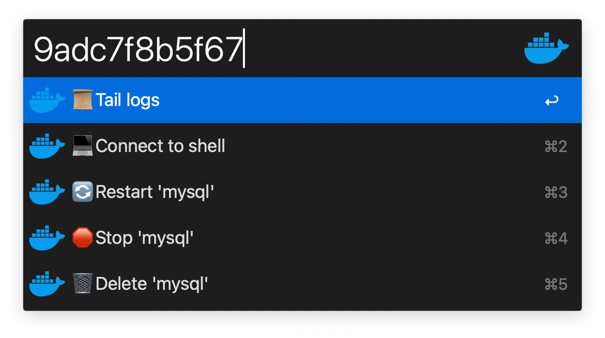
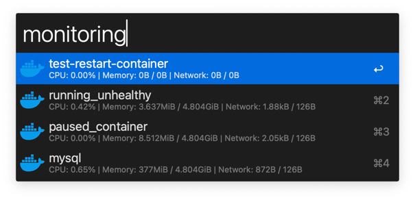
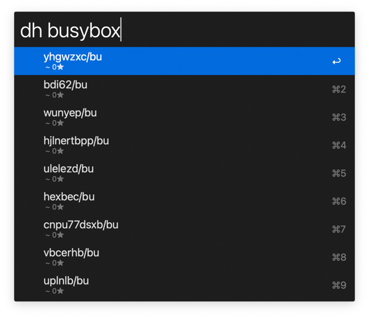
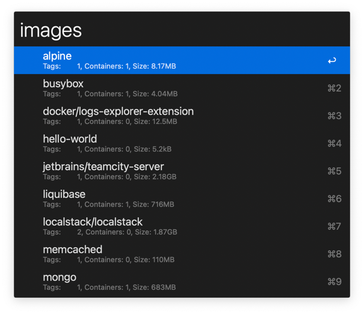
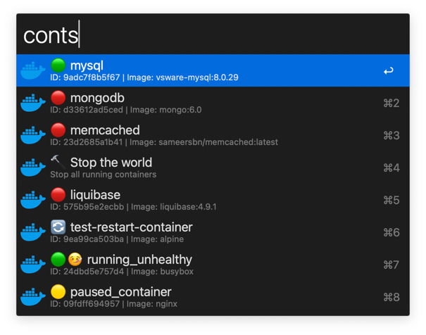
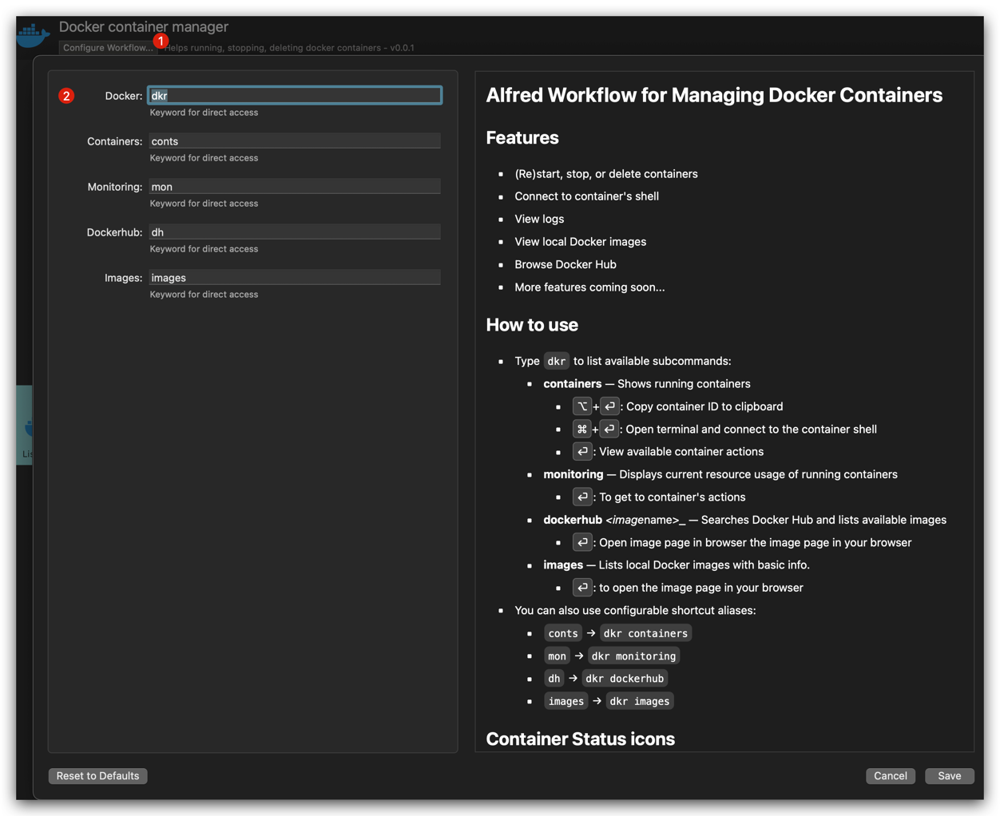
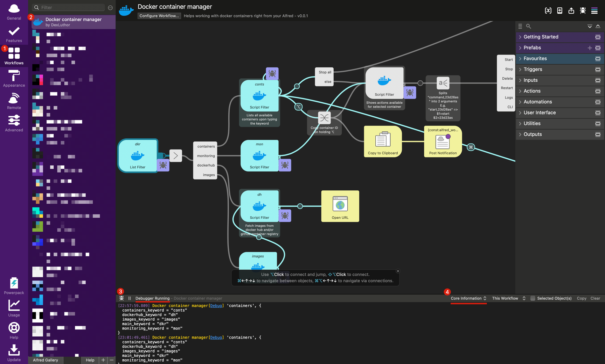

# Alfred Workflow for Managing Docker Containers

## Features

* (Re)start, stop, or delete containers
* Connect to container's shell
* View logs
* View local Docker images
* Browse Docker Hub
* More features coming soon...

## How to use

* Type `dkr` to list available subcommands:
    * **containers** — Shows running containers
      * <kbd>⌥</kbd>+<kbd>⏎</kbd>: Copy container ID to clipboard
      * <kbd>⌘</kbd>+<kbd>⏎</kbd>: Open terminal and connect to the container shell
      * <kbd>⏎</kbd>: View available container actions 
    * **monitoring** — Displays current resource usage of running containers 
        * <kbd>⏎</kbd>: To get to container's actions 
    * **dockerhub** _<image_name>_ — Searches Docker Hub and lists available images 
      * <kbd>⏎</kbd>: Open image page in browser the image page in your browser 
    * **images** — Lists local Docker images with basic info. 
      * <kbd>⏎</kbd>: to open the image page in your browser 
* You can also use configurable shortcut aliases:
    * `conts` → `dkr containers`
    * `mon` → `dkr monitoring`
    * `dh` → `dkr dockerhub`
    * `images` → `dkr images`

## Container Status icons

* `🟢`: **Running** and Healthy
* `🟢🤒`: Running, but **Unhealthy**
* `🟡`: **Paused**
* `🔄`: **Restarting**
* `🔴`: **Not running** - Exited / dead / not started
* `⚪️`: Unknown

## Prerequisites

* **Docker** — Required for container management
* **jq** — Command-line JSON processor used to parse Docker output

## Configuration
If you need to reconfigure the workflow,
you can do so by opening the workflow, clicking `Configure workflow` and modifying available variables:

## Troubleshooting 
If you encounter any issues, you see debugging logs if follow the instructions below:

